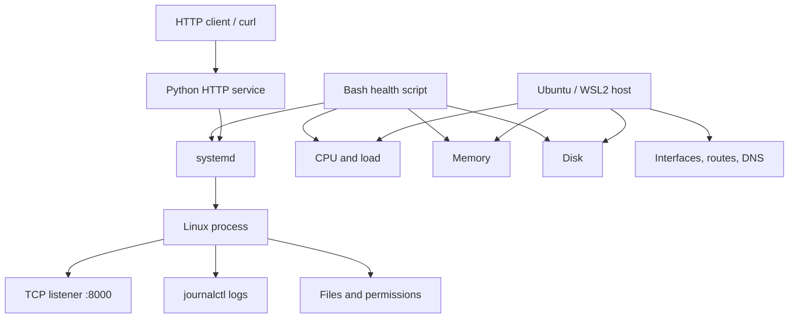

# Linux Operations Lab

A hands-on Linux operations lab for practicing service troubleshooting, system inspection, recovery, and repeatable health checks with Bash.

## Overview

Production issues do not always start in application code. A failed request might come from a stopped service, a permission problem, a missing listener, DNS, routing, or host resource pressure.

I built this lab to practice diagnosing those layers methodically, making the smallest reasonable fix, and then verifying that recovery actually worked.

## Architecture



The service is intentionally small. The point of the project is the operating environment around it: service management, logs, processes, permissions, networking, and host health.

## Key design decisions

- **Troubleshoot by layer.** Service state, logs, processes, ports, permissions, networking, and host resources are checked separately so one symptom does not automatically get blamed on the application.
- **Observe before changing anything.** The workflow starts by collecting evidence with tools such as `systemctl`, `journalctl`, `ps`, `ss`, `curl`, `ip`, `free`, and `df`.
- **Use the smallest corrective action.** Recovery focuses on the specific failing layer instead of restarting or changing unrelated parts of the system.
- **Verification is part of recovery.** A restart is not considered enough; service state, the listening port, and HTTP behavior are checked afterward.
- **Automate repeated diagnostics.** A Bash health script collects common host and service checks into one repeatable first-pass inspection.
- **Keep the application simple.** That makes the Linux behavior easier to isolate and reason about during troubleshooting exercises.

## Quick start

The quickest way to explore the repository is to run the host-health script on a Linux environment:

```bash
git clone https://github.com/gabbyb-cloud/linux-operations-lab.git
cd linux-operations-lab
chmod +x scripts/system-health.sh
./scripts/system-health.sh
```

The script reports hostname, CPU count, uptime and load, memory usage, root filesystem usage, high-memory processes, and the status of the lab service when it is installed.

The repository also includes the example unit file at `systemd/linux-lab.service`. Because it reflects the original local lab setup, update `User=` and `WorkingDirectory=` before installing it on another machine.

## Testing and verification

This repository is an operations lab rather than an application test suite, so verification is done through repeatable troubleshooting scenarios and command-level checks.

The labs cover:

- users, groups, ownership, and permission failures
- process and service inspection
- `systemd` service startup, failure, and recovery
- log investigation with `journalctl`
- TCP listener inspection with `ss`
- HTTP verification with `curl`
- interfaces, routes, DNS, and connectivity checks
- CPU, memory, disk, load, and process inspection
- repeatable host-health collection with Bash

A typical service recovery check looks like this:

```bash
systemctl status linux-lab
journalctl -u linux-lab
ss -lntp
curl http://127.0.0.1:8000
```

Those commands answer different questions: whether `systemd` owns the service, what the service logged, whether the expected socket is listening, and whether the application can actually respond.

The individual lab writeups are in:

- [`labs/01-permissions.md`](labs/01-permissions.md)
- [`labs/02-services-logs.md`](labs/02-services-logs.md)
- [`labs/03-networking.md`](labs/03-networking.md)
- [`labs/04-system-health.md`](labs/04-system-health.md)

## Tradeoffs and limits

**Service failure:** a controlled outage is investigated through service state, logs, process state, and the listening socket before recovery. The service is then restored and checked again at both the OS and HTTP layers.

**Permission failure:** ownership and mode bits are inspected before changes are made. This avoids treating every access problem like an application bug.

**Connectivity failure:** listeners, interfaces, routes, DNS, and direct HTTP checks are used to separate application reachability from host/network problems.

**Host-health concerns:** CPU, load, memory, disk, and process information are inspected together because degraded service behavior can be caused by resource pressure rather than an application defect.

**Automation scope:** the Bash script is deliberately a lightweight first-pass diagnostic tool, not a monitoring platform. It gathers useful evidence quickly but does not provide alerting, historical metrics, or distributed observability.

**Environment:** the original lab was built locally on Ubuntu under WSL2. That keeps the project free and repeatable, but it is not a substitute for operating a multi-host production Linux environment.

## Results

This project does not claim benchmark or production-availability results. Its verified outcomes are operational:

- a controlled service outage can be detected, investigated, recovered, and verified
- permission failures can be reproduced and resolved intentionally
- process, port, and HTTP checks can confirm service recovery at multiple layers
- host-health information can be collected consistently through the Bash script
- the same troubleshooting workflow can be applied across service, permission, network, and resource scenarios

## Next steps

- Add automated smoke tests for the health script and the example service so the repository can validate expected behavior in CI.
- Run the same exercises on a small Linux VM or cloud instance to compare WSL2 behavior with a more production-like host environment.
- Add a second dependent service so networking, dependency failure, and cross-service troubleshooting can be practiced without turning the lab into a large application project.
